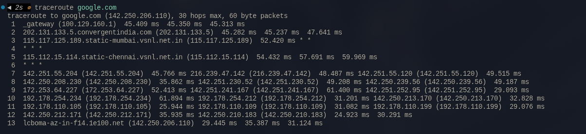
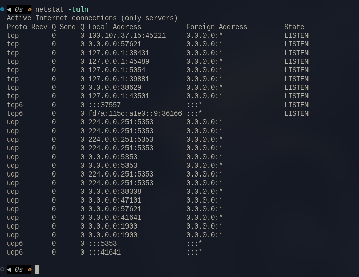
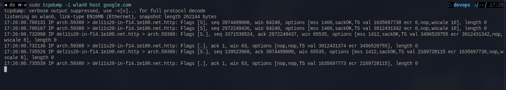
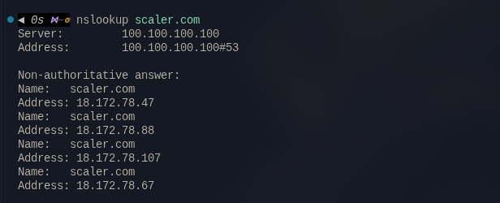
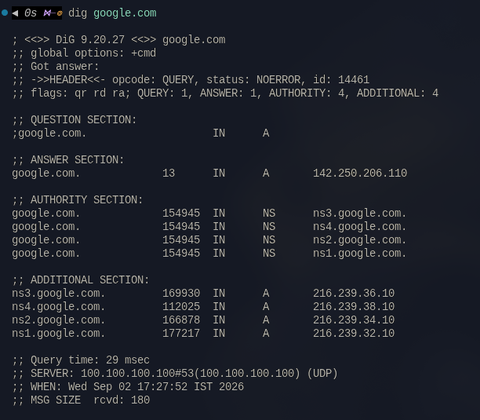
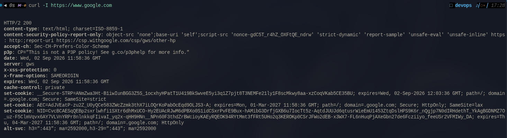
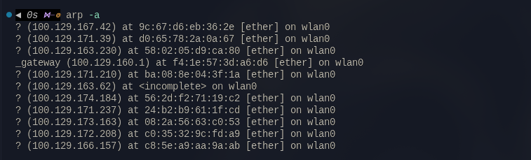
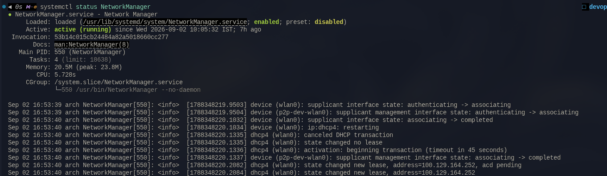

# Network Fundamentals

## 1. `ping`

**Purpose:** Check whether Google is reachable and measure the latency.

**Explanation:** `ping` sends ICMP echo requests and waits for replies. The output shows the response time and packet loss, which helps identify whether the host is reachable and how reliable the connection is. If you see "Request timed out" or receive no response, there may be a network issue or Google may be unavailable.


## 2. `traceroute`

**Purpose:** Identify the route packets take to reach Google and see where delays or failures occur.
**Command:**

`traceroute google.com`



**Explanation:** `traceroute` displays each router, or hop, between your computer and Google. The response times help show where delays are introduced. If you see `* * *`, a hop did not respond; repeated missing responses or high latency can point to filtering, congestion, or a routing problem.

## 3. `netstat`

**Purpose:** Check if any local services are using network ports that might affect connectivity.
**Command:**

`netstat -tuln`



**Explanation:** `netstat -tuln` lists listening TCP and UDP ports without resolving service names. The options show TCP sockets, UDP sockets, listening ports, and numeric addresses. Review the local addresses and port numbers to confirm that expected services are running and no unexpected service is listening.

## 4. `telnet`

**Purpose:** Check connectivity to specific ports on google.com.
**Command:**

`telnet google.com 80`


**Explanation:** `telnet` attempts to open a TCP connection to port 80. A successful connection confirms that the host and port can be reached, although it does not verify that a complete web request will work. A connection failure may indicate a DNS, routing, firewall, or service problem.

## 5. `tcpdump`

**Purpose:** Capture and analyze network packets to see if requests to google.com are being sent and received correctly.
**Command:**

`sudo tcpdump -i eth0 host google.com`



**Explanation:** `tcpdump` captures packets on the `eth0` interface that match the Google host filter. The output can show whether DNS, TCP, and application traffic is leaving and returning. Use `Ctrl+C` to stop the capture, and review packet counts for signs of missing responses or repeated retransmissions.

## 6. `nslookup`

**Purpose:** Query the Domain Name System (DNS) to get the IP address of google.com.

**Command:**

```bash
nslookup google.com
```



**Explanation:** `nslookup` sends a DNS query through the configured DNS server and displays the returned IP address. This helps verify that name resolution is working before testing a network connection. If it fails, check the DNS configuration, server availability, or domain name.

## 7. `dig`

**Purpose:** Provides detailed DNS query information about google.com, including its IP address and authoritative DNS servers.

**Command:**
`dig google.com`



**Explanation:** `dig` provides detailed DNS information, including the query status, records returned, response time, and the server that answered. It is useful for troubleshooting DNS resolution and inspecting record types such as `A`, `AAAA`, and `MX`.

## 8. `curl`

**Purpose:** Test HTTP/HTTPS connectivity to Google and inspect the response headers.

**Command:**

`curl -I https://www.google.com`



**Explanation:** `curl -I` sends a request for the HTTP headers without downloading the full page. The response includes the status code, server information, and redirect details. A failure can indicate a DNS, TLS, firewall, proxy, or web server problem.

## 9. `arp`

**Purpose:** View and manage the ARP (Address Resolution Protocol) table, which maps IP addresses to MAC addresses.

**Command:**
`arp -a`



**Explanation:** `arp -a` displays cached ARP entries for local network devices. Each entry maps an IP address to a MAC address and may include the network interface and entry state. Missing or incorrect entries can indicate a local network, gateway, or ARP configuration problem.

## 10. `systemctl`

**Purpose:** Check if network services are running properly on your machine.

**Command:**
`systemctl status NetworkManager`



**Explanation:** `systemctl status` shows whether NetworkManager is active, when it started, and recent service messages. An active service indicates that the network manager is running, while an inactive or failed state may prevent automatic interface, Wi-Fi, or DNS configuration.
