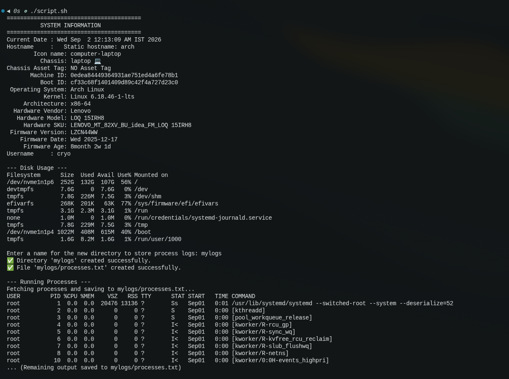

# System Info & Process Logger

A simple Bash script that displays real-time system details including the current date, hostname, active user, and disk usage.
The script interactively prompts you for a directory name and automatically saves a log of all running processes into that new folder.

## OUTPUT

