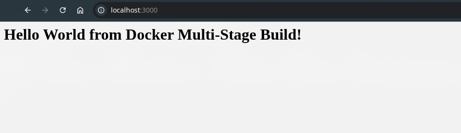
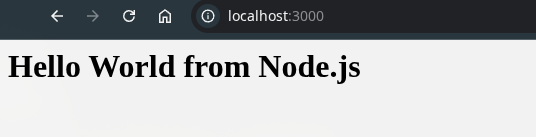
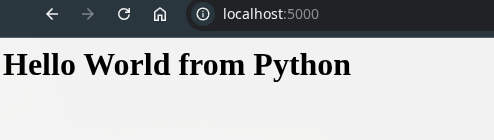
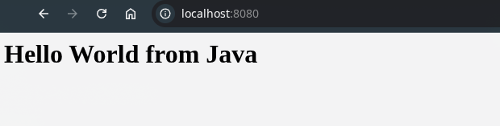

# Docker Assignment

**Name :** Pushkar Desai

**Roll Number :** 24BCS10085

SS of container running :

---

SS of docker ps :

---

## TASK 3:

Already deployed in the previous task, here are the screenshots:

1. NodeJs App :

2. Python App :

3. Java App :

